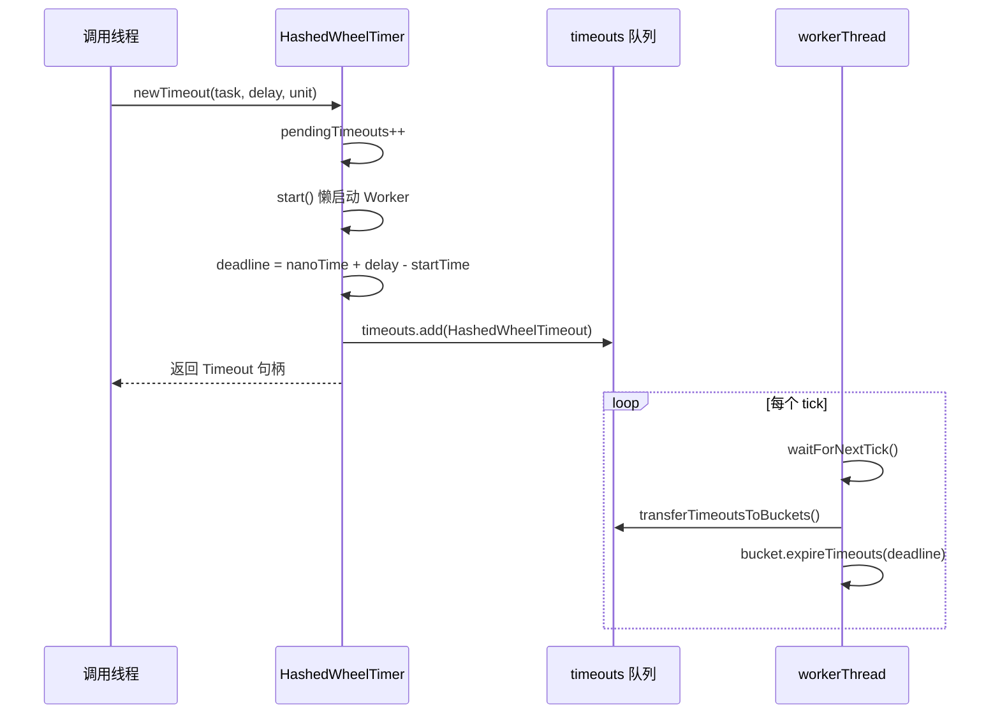
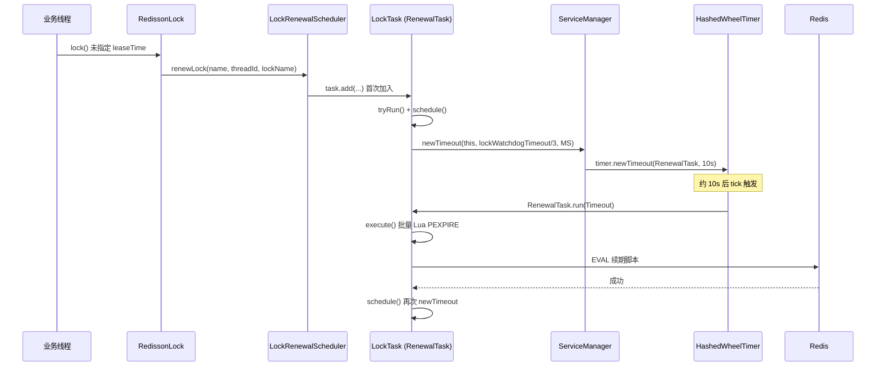

# Netty 时间轮（HashedWheelTimer）详解

> 关联文档：[REDISSON_ARCHITECTURE.md](./REDISSON_ARCHITECTURE.md)  
> Netty 版本：4.2.14.Final（Redisson 父 POM 管理）  
> 源码参考：`io.netty.util.HashedWheelTimer`（`netty-common` 模块）

---

## 目录

1. [为什么需要时间轮](#1-为什么需要时间轮)
2. [时间轮理论基础](#2-时间轮理论基础)
3. [Netty HashedWheelTimer 概览](#3-netty-hashedwheeltimer-概览)
4. [核心数据结构](#4-核心数据结构)
5. [实现原理（源码级剖析）](#5-实现原理源码级剖析)
6. [精度、性能与限制](#6-精度性能与限制)
7. [Redisson Watchdog 如何使用时间轮](#7-redisson-watchdog-如何使用时间轮)
8. [Redisson 中的其他时间轮用法](#8-redisson-中的其他时间轮用法)
9. [使用建议与常见误区](#9-使用建议与常见误区)
10. [与其他定时器实现对比](#10-与其他定时器实现对比)
11. [总结](#11-总结)

---

## 1. 为什么需要时间轮

在 Redis 客户端、网络框架、游戏服务器等场景中，大量操作依赖 **超时（Timeout）** 机制：

| 场景 | 典型超时 |
|------|---------|
| 分布式锁 Watchdog | 每 10 秒续期一次 |
| TCP 连接 / 命令响应 | 3 秒未响应则失败 |
| 心跳 Ping | 每 30 秒发一次 |
| 空闲连接回收 | 10 分钟无活动则关闭 |

若用 **`java.util.Timer`** 或 **`ScheduledThreadPoolExecutor`** 为每个超时任务单独调度：

- 每个任务对应一个调度条目，任务数量大时 **内存与 CPU 开销高**
- 插入/删除多为 **O(log n)**（基于堆的优先队列）
- 高并发下锁竞争明显

**时间轮（Timing Wheel）** 用「槽位 + 指针推进」的方式，将 **添加超时任务摊销为 O(1)**，用固定数量的桶承载海量定时任务，非常适合 I/O 框架中「大量、精度要求不高」的超时场景。

Netty 的 `HashedWheelTimer` 正是这一思路的工程实现，也是 Redisson Watchdog 的调度基础。

---

## 2. 时间轮理论基础

### 2.1 简单时间轮（单层）

把时间轴切成等宽的 **槽（Slot）**，指针每隔 **tickDuration** 前进一格，当前槽上的任务到期执行。

```
时间轴:  |----|----|----|----|----|----|----|----|
槽位:      0    1    2    3    4    5    6    7
              ↑
            当前指针

任务 A: 3 tick 后到期 → 放在槽 (current + 3) % 8
任务 B: 11 tick 后到期 → 需要「绕圈」，单层轮无法直接表示
```

**问题：** 若轮的大小为 `n`，只能直接表示 **0 ~ n-1 个 tick** 内的超时；更长的超时需要 **多圈（remainingRounds）** 或 **分层时间轮**。

### 2.2 哈希时间轮（Hashed Wheel）

Netty 采用的是 **哈希时间轮**（Hashed and Hierarchical Timing Wheels，Varghese & Lauck, 1987）的 **单层简化版**：

- 槽位索引 = `deadline / tickDuration & (wheelSize - 1)`（wheelSize 为 2 的幂）
- 相当于用 **到期时间的哈希值** 决定任务挂在哪个桶
- 同一桶内用 **双向链表** 串联多个 `Timeout`
- 超过一轮的超时，用 **`remainingRounds`** 记录还需绕几圈

```
                    HashedWheelTimer
                    ┌─────────────────────────────────┐
  newTimeout() ──►  │  MPSC 队列 timeouts（待入桶）    │
                    └──────────────┬──────────────────┘
                                   │ 每个 tick 转移
                    ┌──────────────▼──────────────────┐
                    │  wheel[0] wheel[1] ... wheel[n]  │  ◄── Worker 线程每 tick 推进
                    │    │        │           │        │
                    │   链表      链表        链表      │
                    └─────────────────────────────────┘
                                   │ 到期
                    ┌──────────────▼──────────────────┐
                    │  taskExecutor 执行 TimerTask.run │
                    └─────────────────────────────────┘
```

### 2.3 分层时间轮（了解即可）

对于跨度极大的超时（秒级到小时级），论文提出 **多层时间轮**：上层一格代表下层一整圈。Netty **未实现完整分层**，而是通过 `remainingRounds` 在单层轮上模拟多圈，实现简单、对网络超时足够用。

---

## 3. Netty HashedWheelTimer 概览

### 3.1 类与接口关系

```
                    ┌─────────────┐
                    │   Timer     │  接口：newTimeout(), stop()
                    └──────┬──────┘
                           │ implements
                    ┌──────▼──────────────┐
                    │  HashedWheelTimer   │  唯一实现（Netty 4.x）
                    └──────┬──────────────┘
                           │ 创建
              ┌────────────┼────────────┐
              ▼            ▼            ▼
      HashedWheelTimeout  Worker   HashedWheelBucket[]
      (implements Timeout,
       Runnable)
              │
              │ 持有
              ▼
         TimerTask  接口：void run(Timeout timeout)
```

### 3.2 官方文档中的关键参数

| 参数 | 默认值 | 含义 |
|------|--------|------|
| **tickDuration** | 100 ms | 指针每格代表的时间；越小越精确，CPU 唤醒越频繁 |
| **ticksPerWheel** | 512 | 槽位数；会向上取整为 **2 的幂** |
| **maxPendingTimeouts** | 无限制 | 待处理超时上限，超出抛 `RejectedExecutionException` |
| **taskExecutor** | `ImmediateExecutor` | 到期后执行 `TimerTask` 的线程池 |

### 3.3 设计目标（Netty 官方注释摘要）

1. **近似调度**：不保证毫秒级精确，适合 I/O 超时
2. **高吞吐添加**：`newTimeout` 先放入 MPSC 队列，由 Worker 批量入桶
3. **单 Worker 线程**：一个 Timer 实例一个 `workerThread`，避免多实例泛滥（JVM 内建议 **共享少量实例**）
4. **取消友好**：`cancel()` 仅改状态，真正从链表移除延迟最多 **1 个 tick**

---

## 4. 核心数据结构

### 4.1 HashedWheelTimer 字段

```java
public class HashedWheelTimer implements Timer {
    private final long tickDuration;              // 纳秒
    private final HashedWheelBucket[] wheel;      // 槽数组
    private final int mask;                       // wheel.length - 1，用于取模
    private final Thread workerThread;            // 唯一工作线程
    private final Queue<HashedWheelTimeout> timeouts;           // MPSC，待入桶
    private final Queue<HashedWheelTimeout> cancelledTimeouts;  // MPSC，待移除
    private final AtomicLong pendingTimeouts;     // 计数
    private final Executor taskExecutor;          // 执行 TimerTask
    private volatile long startTime;              // Worker 启动时的 nanoTime
}
```

### 4.2 HashedWheelTimeout（定时任务句柄）

```java
private static final class HashedWheelTimeout implements Timeout, Runnable {
    private final TimerTask task;
    private final long deadline;        // 相对 startTime 的纳秒截止时间
    long remainingRounds;               // 还需绕轮几圈
    HashedWheelTimeout next, prev;      // 桶内双向链表
    HashedWheelBucket bucket;
    volatile int state;               // INIT / CANCELLED / EXPIRED
}
```

**deadline 计算**（`newTimeout` 时）：

```java
long deadline = System.nanoTime() + unit.toNanos(delay) - startTime;
```

使用 **相对时间**，避免 `System.nanoTime()` 在 Worker 未启动时为 0 的问题。

### 4.3 HashedWheelBucket（槽 / 桶）

每个桶是一条 **双向链表**，头尾指针 `head` / `tail`：

```java
private static final class HashedWheelBucket {
    private HashedWheelTimeout head;
    private HashedWheelTimeout tail;

    void addTimeout(HashedWheelTimeout timeout);      // 尾插
    void expireTimeouts(long deadline);               // 扫描到期任务
    HashedWheelTimeout remove(HashedWheelTimeout timeout);
}
```

**为何用双向链表？**  
`cancel()` 可能在链表中间删除节点，双向链表 O(1) 删除；且 `HashedWheelTimeout` 自身作为节点，**无需额外链表节点对象**，减少 GC。

---

## 5. 实现原理（源码级剖析）

### 5.1 构造：轮大小归一化为 2 的幂

```java
private static HashedWheelBucket[] createWheel(int ticksPerWheel) {
    ticksPerWheel = MathUtil.findNextPositivePowerOfTwo(ticksPerWheel);
    HashedWheelBucket[] wheel = new HashedWheelBucket[ticksPerWheel];
    for (int i = 0; i < wheel.length; i++) {
        wheel[i] = new HashedWheelBucket();
    }
    return wheel;
}
// mask = wheel.length - 1
// 索引计算: index = (int)(ticks & mask)  等价于 ticks % wheel.length
```

Redisson 使用 `ticksPerWheel = 1024`，故 `mask = 1023`，最大可直接覆盖的时间跨度约为：

```
1024 × tickDuration
```

在 Redisson 配置下 `tickDuration ≈ 50~100ms`，单圈约 **51~102 秒**；更长的 delay 靠 `remainingRounds` 多圈完成。

### 5.2 提交超时：newTimeout()



**要点：**

1. **两阶段入桶**：调用线程只入 `timeouts` 队列，不直接操作 `wheel`，减少锁竞争
2. **懒启动**：首次 `newTimeout` 时 `workerThread.start()`
3. **MPSC 队列**：`PlatformDependent.newMpscQueue()`，多生产者单消费者，适合 Netty 多 EventLoop 线程提交超时

### 5.3 Worker 主循环

```java
public void run() {
    startTime = System.nanoTime();
    if (startTime == 0) startTime = 1;
    startTimeInitialized.countDown();

    do {
        final long deadline = waitForNextTick();
        if (deadline > 0) {
            int idx = (int) (tick & mask);
            processCancelledTasks();
            transferTimeoutsToBuckets();
            wheel[idx].expireTimeouts(deadline);
            tick++;
        }
    } while (workerState == WORKER_STATE_STARTED);
    // shutdown: 收集未处理 Timeout...
}
```

每个 **tick** 的顺序：

1. **waitForNextTick()** — 睡眠直到下一格边界
2. **processCancelledTasks()** — 从 `cancelledTimeouts` 取出，从桶链表 **remove**
3. **transferTimeoutsToBuckets()** — 从 `timeouts` 队列最多转移 **100000** 个到对应桶
4. **wheel[idx].expireTimeouts(deadline)** — 处理当前槽到期任务

### 5.4 waitForNextTick()：驱动指针

```java
private long waitForNextTick() {
    long deadline = tickDuration * (tick + 1);
    for (;;) {
        final long currentTime = System.nanoTime() - startTime;
        long sleepTimeMs = (deadline - currentTime + 999999) / 1000000;

        if (sleepTimeMs <= 0) {
            return currentTime;  // 到达下一 tick
        }

        // Windows 上 sleep 精度问题，特殊舍入
        if (PlatformDependent.isWindows()) {
            sleepTimeMs = sleepTimeMs / 10 * 10;
            if (sleepTimeMs == 0) sleepTimeMs = 1;
        }
        Thread.sleep(sleepTimeMs);
    }
}
```

- 使用 **`Thread.sleep`**，非 `LockSupport.parkNanos`（历史原因 + Windows 兼容性）
- 因此精度受 OS 调度影响，通常 **毫秒级**
- tick 边界可能 **略晚于** 理论时间，属于「近似定时」

### 5.5 transferTimeoutsToBuckets()：入桶与 remainingRounds

```java
private void transferTimeoutsToBuckets() {
    for (int i = 0; i < 100000; i++) {
        HashedWheelTimeout timeout = timeouts.poll();
        if (timeout == null) break;
        if (timeout.state() == ST_CANCELLED) continue;

        long calculated = timeout.deadline / tickDuration;
        timeout.remainingRounds = (calculated - tick) / wheel.length;

        final long ticks = Math.max(calculated, tick);  // 不调度到过去
        int stopIndex = (int) (ticks & mask);

        wheel[stopIndex].addTimeout(timeout);
    }
}
```

**示例**（`wheel.length = 8`, `tick = 2`, `tickDuration = 100ms`）：

| 任务 | deadline/tickDuration | calculated | remainingRounds | stopIndex |
|------|----------------------|------------|-----------------|-----------|
| T1 | 5 | 5 | (5-2)/8 = 0 | 5 & 7 = 5 |
| T2 | 20 | 20 | (20-2)/8 = 2 | 20 & 7 = 4 |

- **remainingRounds = 0**：当前圈指针到达该槽且 `deadline <= 当前 deadline` 时 **真正 expire**
- **remainingRounds > 0**：每经过该槽一次 **减 1**，不执行

### 5.6 expireTimeouts()：触发回调

```java
public void expireTimeouts(long deadline) {
    HashedWheelTimeout timeout = head;
    while (timeout != null) {
        HashedWheelTimeout next = timeout.next;
        if (timeout.remainingRounds <= 0) {
            if (timeout.deadline <= deadline) {
                timeout.expire();
            } else {
                throw new IllegalStateException(...); // 不应出现
            }
        } else if (!timeout.isCancelled()) {
            timeout.remainingRounds--;
        }
        timeout = next;
    }
}
```

**expire()** 逻辑：

```java
public void expire() {
    if (!compareAndSetState(ST_INIT, ST_EXPIRED)) return;
    try {
        remove();                              // 从桶移除，pendingTimeouts--
        timer.taskExecutor.execute(this);      // this 实现了 Runnable
    } catch (Throwable t) { ... }
}

@Override
public void run() {
    task.run(this);   // 执行用户 TimerTask
}
```

默认 `taskExecutor = ImmediateExecutor.INSTANCE`，即在 **Worker 线程内同步执行** `TimerTask.run()`。若任务耗时，会 **阻塞后续 tick**，因此 `TimerTask` 应尽快完成，耗时逻辑应投递到其他线程池（Redisson 的 Watchdog 正是这样做的，见第 7 节）。

### 5.7 cancel()：延迟删除

```java
public boolean cancel() {
    if (!compareAndSetState(ST_INIT, ST_CANCELLED)) return false;
    timer.cancelledTimeouts.add(this);  // 仅入队，不立即从桶删除
    return true;
}
```

- 从桶中真正移除发生在 **下一个 tick** 的 `processCancelledTasks()`
- 最多延迟 **1 个 tickDuration** 才释放引用
- 避免在调用线程与 Worker 线程间对同一桶链表加锁

### 5.8 实例数量警告

```java
private static final int INSTANCE_COUNT_LIMIT = 64;

if (INSTANCE_COUNTER.incrementAndGet() > INSTANCE_COUNT_LIMIT) {
    reportTooManyInstances();  // 打 ERROR 日志
}
```

每个 `HashedWheelTimer` 创建一个 **专用线程**。Redisson 在 `ServiceManager` 中 **全局只创建一个**（`redisson-timer`），符合 Netty 建议。

---

## 6. 精度、性能与限制

### 6.1 时间精度

实际触发时间：

```
实际触发 ≈ 请求 delay + [0, tickDuration) + 调度抖动 + TimerTask 排队时间
```

| 因素 | 影响 |
|------|------|
| tickDuration | 最大系统性误差约 1 tick |
| Thread.sleep | OS 调度，Windows 上额外舍入 |
| 同 tick 大量任务 | 顺序执行，后面任务延迟 |
| transfer 上限 100000/tick | 极端突发时入桶可能滞后 |

对 **Watchdog 续期**（默认 30s 租约、10s 调度一次），1 tick 级误差完全可以接受。

### 6.2 复杂度

| 操作 | 均摊复杂度 |
|------|-----------|
| newTimeout | O(1) 入队 |
| cancel | O(1) 状态 + 延迟删除 |
| tick 推进 | O(当前槽链表长度 + 转移队列长度) |

### 6.3 不适用场景

- 需要 **亚毫秒级** 精确定时
- **海量** 短周期任务且每个任务执行很重（会阻塞 Worker）
- 为 **每个连接** 创建一个 `HashedWheelTimer`（线程爆炸）

---

## 7. Redisson Watchdog 如何使用时间轮

### 7.1 全局 Timer 的创建

`ServiceManager.initTimer()` 中创建 **整个 JVM 客户端实例共享** 的一个时间轮：

```java
// ServiceManager.java
timer = new HashedWheelTimer(
    new DefaultThreadFactory("redisson-timer"),
    minTimeout,              // tickDuration，约 10~100ms，由 retry/timeout 推导
    TimeUnit.MILLISECONDS,
    1024,                    // ticksPerWheel
    false                    // leakDetection
);

public Timeout newTimeout(TimerTask task, long delay, TimeUnit unit) {
    return timer.newTimeout(task, delay, unit);
}
```

**minTimeout 推导逻辑**（简化）：

- 取 `retryDelay` 与 `config.timeout` 的较小值
- 规整到 10、50 或 100 ms 附近
- 保证 tick 与网络重试/超时配置量级一致

### 7.2 Watchdog 调度链路



### 7.3 RenewalTask：实现 TimerTask

```java
abstract class RenewalTask implements TimerTask {

    public void schedule() {
        if (!running.get()) return;

        long internalLockLeaseTime = executor.getServiceManager()
            .getCfg().getLockWatchdogTimeout();  // 默认 30000ms
        executor.getServiceManager().newTimeout(
            this,
            internalLockLeaseTime / 3,           // 默认 10000ms
            TimeUnit.MILLISECONDS
        );
    }

    @Override
    public void run(Timeout timeout) {
        if (executor.getServiceManager().isShuttingDown()) return;

        CompletionStage<Void> future = execute();  // 异步续期，不阻塞 Worker 太久
        future.whenComplete((result, e) -> {
            if (e != null) {
                log.error("Can't update locks expiration", e);
            }
            schedule();  // 无论成功失败，都预约下一次
        });
    }
}
```

**设计要点：**

| 点 | 说明 |
|----|------|
| **周期 = leaseTime / 3** | 30s 租约每 10s 续一次，至少 2 次续期机会，防止单次 tick 误差导致过期 |
| **run() 内异步 Redis** | `execute()` 走 `CommandAsyncExecutor`，避免在 `redisson-timer` 线程执行网络 I/O |
| **链式 schedule** | 每次 `run` 结束后再 `newTimeout`，形成 **周期性 Watchdog**，而非 `scheduleAtFixedRate` |
| **running 标志** | 所有锁释放且 `name2entry` 为空时 `stop()`，不再 schedule |
| **批量续期** | `LockTask` 用 `AsyncChunkProcessor` 每批最多 100 把锁（`lockWatchdogBatchSize`） |

### 7.4 与锁生命周期的关系

```
lock() 成功
  └─► scheduleExpirationRenewal(threadId)
        └─► LockRenewalScheduler.renewLock()
              └─► LockTask.add()
                    └─► 首次 schedule() → HashedWheelTimer

unlock() 成功
  └─► cancelExpirationRenewal(threadId)
        └─► LockTask.cancelExpirationRenewal()
              └─► 从 name2entry 移除
              └─► 若无其他线程持有 → stop()，不再 schedule
              └─► 已提交的 Timeout 可能被 cancel（unlock 后不再续期）
```

**注意：** `cancel()` 对 **已入桶但未触发** 的 `Timeout` 有效；若 `run()` 已开始执行续期，则需依赖 Lua 脚本中 `HEXISTS` 判断锁是否仍属于当前线程。

### 7.5 时间轮参数与 Watchdog 参数对照

| 配置项 | 默认值 | 作用 |
|--------|--------|------|
| `lockWatchdogTimeout` | 30000 ms | Redis 锁 key 的 PEXPIRE 时长 |
| `lockWatchdogTimeout / 3` | 10000 ms | 时间轮 **delay**（续期间隔） |
| `lockWatchdogBatchSize` | 100 | 每批 Lua 续期锁数量 |
| HashedWheelTimer tickDuration | ~50–100 ms | 触发精度（由 ServiceManager 计算） |
| ticksPerWheel | 1024 | 时间轮槽数 |

**不等关系：**

- Watchdog **逻辑周期** 10s >> **tickDuration** 100ms，时间轮误差占比 < 1%
- 锁 **租约** 30s > **续期间隔** 10s × 2，保证至少两次续期窗口

---

## 8. Redisson 中的其他时间轮用法

除 Watchdog 外，Redisson 通过 `ServiceManager.newTimeout()` 或 `RedisClient` 私有 Timer 调度多种超时：

| 场景 | 调用位置 | 典型 delay |
|------|---------|------------|
| 命令执行超时 | `RedisConnection.send()` | `commandTimeout` |
| 命令重试退避 | `RedisConnection.async()` | `retryDelay` |
| 连接 Ping | `PingConnectionHandler` | `pingConnectionInterval` |
| 集群拓扑刷新 | `ClusterConnectionManager` | 配置的 scanInterval |
| MapCache 驱逐 | `EvictionTask` | 随机 5~1800s |
| 锁等待超时 | `RedissonLock` tryLock | 用户指定 waitTime |
| Remote Service Ack | `BaseRemoteProxy` | ackTimeout |

### 8.1 两套 Timer 实例

| 实例 | 创建位置 | 线程名 | 用途 |
|------|---------|--------|------|
| **ServiceManager.timer** | `initTimer()` | `redisson-timer` | Watchdog、集群监控、驱逐等 **全局** 任务 |
| **RedisClient.timer** | 每客户端未注入时 `new HashedWheelTimer()` | Netty 默认 | **单连接** 命令超时、重试（默认参数 100ms tick） |

生产环境应通过 `Config` / `RedisClientConfig` **共享** `ServiceManager.getTimer()`，避免每连接一个 Timer 线程。

### 8.2 命令超时示例（RedisConnection）

```java
Timeout scheduledFuture = redisClient.getTimer().newTimeout(t -> {
    RedisTimeoutException ex = new RedisTimeoutException("Command execution timeout ...");
    promise.completeExceptionally(ex);
}, timeout, TimeUnit.MILLISECONDS);

// 命令完成时 cancel
scheduledFuture.cancel();
```

与时间轮的关系：每个命令一次 `newTimeout`，完成后 `cancel()`；高 QPS 下依赖时间轮 **O(1) 添加/取消** 的能力。

---

## 9. 使用建议与常见误区

### 9.1 推荐做法

1. **全应用共享少量 HashedWheelTimer**（Redisson 已做到每 `RedissonClient` 一个 ServiceManager Timer）
2. **TimerTask.run() 中只做轻量逻辑**，IO/计算投递到业务或 Netty EventLoop
3. **根据最大超时选择 tickDuration**：最大误差约 1 tick，tick 不必远小于最短超时
4. **ticksPerWheel** 满足 `ticksPerWheel × tickDuration ≥ 常用最大超时` 可减少 remainingRounds 开销（非硬性）
5. 关闭客户端时调用 `timer.stop()`（ServiceManager shutdown 路径）

### 9.2 常见误区

| 误区 | 后果 |
|------|------|
| 每个 Channel 一个 Timer | 线程数爆炸，触发 Netty 64 实例告警 |
| 在 TimerTask 中阻塞执行 Redis | 阻塞 `redisson-timer`，所有 Watchdog/超时延迟 |
| 把 HashedWheelTimer 当精确闹钟 | 毫秒级不准，应用 `ScheduledExecutorService` 或 `java.time` |
| 忘记 cancel Timeout | 任务仍会触发（命令超时场景会误报） |
| delay = 0 期望立即执行 | 至少等到下一个 tick 入桶并扫描 |

### 9.3 与 Redisson Watchdog 相关的调优

```yaml
# 概念示例（Java Config API）
config.setLockWatchdogTimeout(30000);   # 锁在 Redis 上的 TTL
config.setLockWatchdogBatchSize(100);    # 批量续期大小
# 续期间隔 = lockWatchdogTimeout / 3，代码写死，不可单独配置
```

若缩短 `lockWatchdogTimeout`，续期间隔同比缩短，需确保 **仍大于几次 tickDuration 之和**，否则受时间轮精度影响更大。

---

## 10. 与其他定时器实现对比

| 实现 | 数据结构 | 添加 | 触发精度 | 线程模型 | 典型场景 |
|------|---------|------|---------|---------|---------|
| **HashedWheelTimer** | 哈希槽 + 链表 | O(1) | ~tickDuration | 1 Worker + 可选 Executor | Netty I/O 超时、Redisson Watchdog |
| **ScheduledThreadPoolExecutor** | 延迟队列（堆） | O(log n) | 较高 | 线程池 | 通用定时任务 |
| **java.util.Timer** | 单线程 + 堆 | O(log n) | 一般 | 单线程 | 遗留 API，不推荐 |
| **Kafka TimingWheel** | 分层时间轮 | O(1) | 高 | 独立线程 | 超大规模延迟队列 |
| **Hierarchical Timer Wheel** | 多层轮 | O(1) | 高 | 视实现 | 超大延迟跨度 |

Redisson 选择 Netty HashedWheelTimer 的原因：

1. 与 **Netty 生态统一**，无额外依赖
2. 客户端场景 **超时任务多、精度要求低**，与时间轮契合
3. Watchdog **长周期、重复调度**，`newTimeout` + 链式 `schedule` 简单可靠
4. **cancel** 锁续期时开销低

---

## 11. 总结

### 11.1 HashedWheelTimer 核心思想

- 用 **固定槽位数组** 代替优先队列，以 **tick 推进** 扫描到期任务
- 用 **哈希（deadline / tickDuration）** 决定槽位，用 **remainingRounds** 支持超长延迟
- 用 **MPSC 队列** 解耦提交线程与 Worker，用 **延迟取消** 降低锁竞争

### 11.2 Redisson Watchdog 如何用

```
RedissonBaseLock.scheduleExpirationRenewal()
  → LockRenewalScheduler.renewLock()
    → LockTask (implements TimerTask)
      → ServiceManager.newTimeout(task, lockWatchdogTimeout/3, MS)
        → HashedWheelTimer（redisson-timer 线程）
          → RenewalTask.run() → 异步 Lua PEXPIRE → schedule() 循环
```

时间轮只负责 **「每隔约 10 秒叫醒一次」**；真正续期逻辑在 `LockTask.execute()` 的 Redis Lua 脚本中完成。二者分工明确：**时间轮 = 调度器，Lua = 业务语义**。

### 11.3 关键源码索引

| 内容 | 位置 |
|------|------|
| Netty 时间轮实现 | `io.netty.util.HashedWheelTimer` |
| Redisson 全局 Timer | `org.redisson.connection.ServiceManager#initTimer` |
| Watchdog 任务 | `org.redisson.renewal.RenewalTask` |
| 锁续期批量 Lua | `org.redisson.renewal.LockTask#buildChunk` |
| 调度入口 | `org.redisson.renewal.LockRenewalScheduler` |
| 触发续期调度 | `org.redisson.RedissonBaseLock#scheduleExpirationRenewal` |

---

## 附录 A：单 tick 完整流程图

```
┌─────────────────────────────────────────────────────────────────┐
│                     Worker Thread (每 tick)                      │
├─────────────────────────────────────────────────────────────────┤
│  1. waitForNextTick()                                            │
│       └─ Thread.sleep 直到 tickDuration * (tick+1)               │
│                                                                  │
│  2. idx = tick & mask                                            │
│                                                                  │
│  3. processCancelledTasks()                                      │
│       └─ cancelledTimeouts.poll() → bucket.remove()              │
│                                                                  │
│  4. transferTimeoutsToBuckets()  (最多 100000 个)                 │
│       └─ timeouts.poll() → 计算 remainingRounds → wheel[idx]   │
│                                                                  │
│  5. wheel[idx].expireTimeouts(deadline)                          │
│       ├─ remainingRounds > 0  → remainingRounds--                │
│       └─ remainingRounds == 0 且 deadline 到 → expire()         │
│              └─ taskExecutor.execute(timeout) → task.run()       │
│                                                                  │
│  6. tick++                                                       │
└─────────────────────────────────────────────────────────────────┘
```

## 附录 B：remainingRounds 数值示例

设：`wheel.length = 4`, `tickDuration = 100ms`, 当前 `tick = 1`

| 当前时间 | 任务 delay | calculated | remainingRounds | 首次进入槽位 | 实际 expire 的 tick |
|---------|-----------|------------|-----------------|-------------|---------------------|
| 100ms | 250ms | 3 | (3-1)/4=0 | 3 | 3 |
| 100ms | 650ms | 7 | (7-1)/4=1 | 3 | 7（槽 3 遇 2 次减 rounds） |
| 100ms | 50ms | 1 | 0 | 1 | 1 |

（表中「当前时间」以 `startTime` 为 0，`calculated = deadline / tickDuration` 的简化说明，便于理解 rounds 与槽位关系。）

---

*本文档基于 Netty 4.1/4.2 `HashedWheelTimer` 源码与 Redisson 4.4.1-SNAPSHOT 分析生成。*
