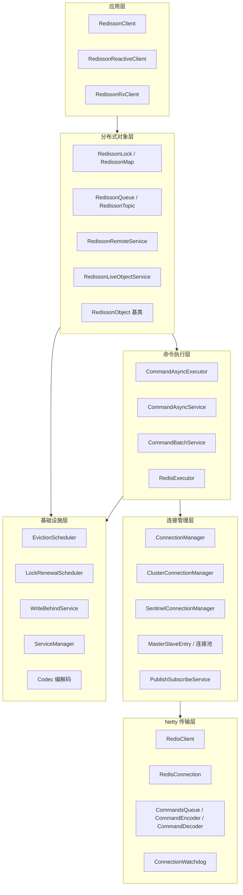
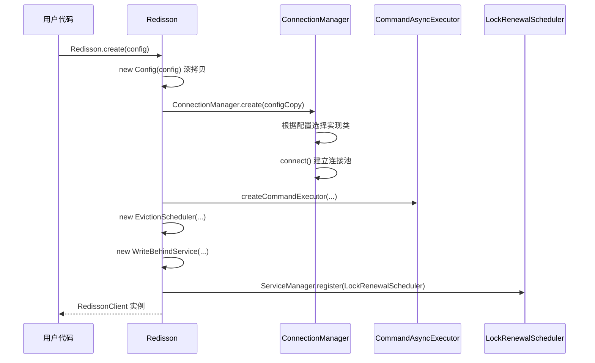
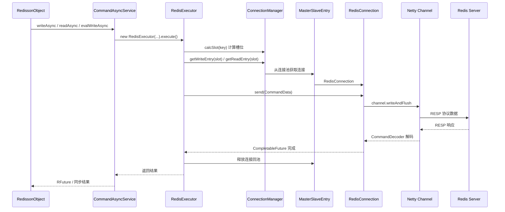
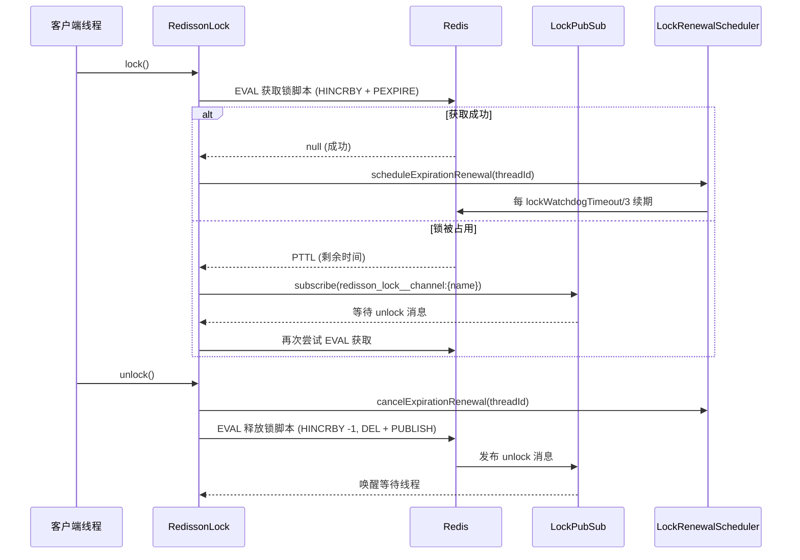
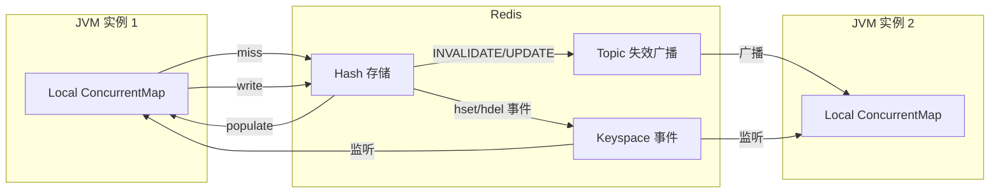
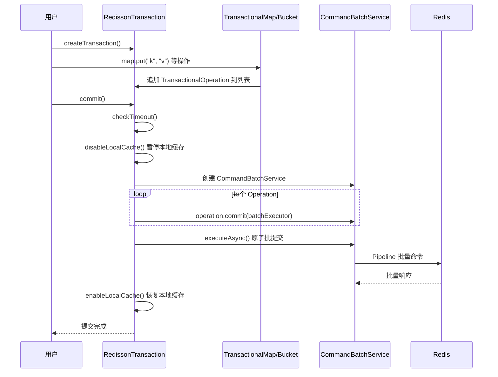
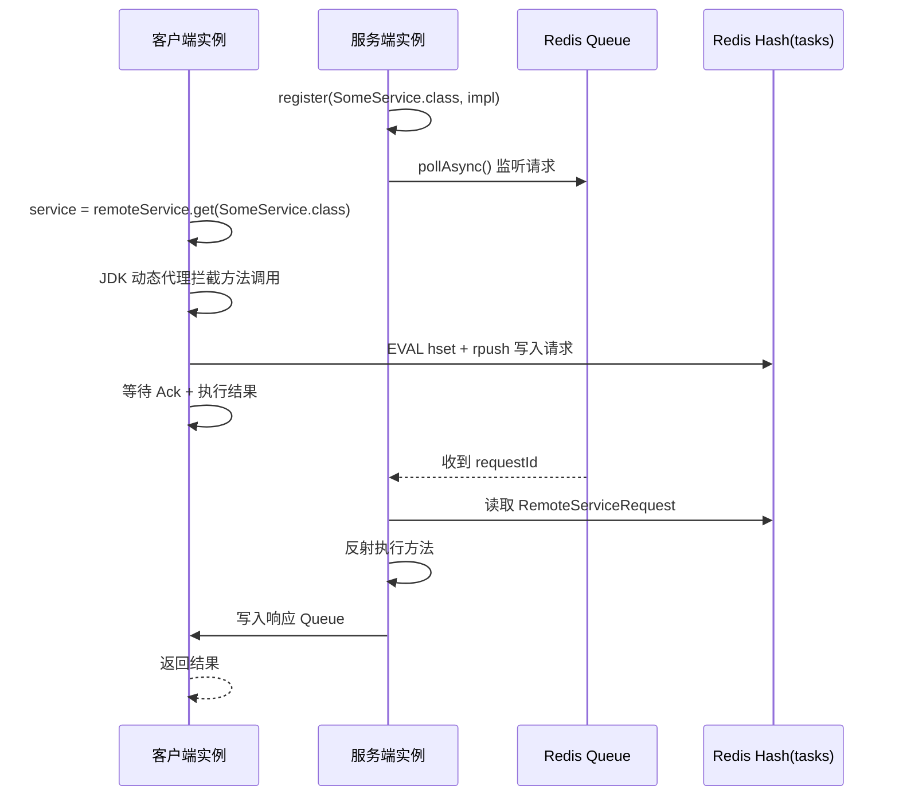

# Redisson 项目架构分析

> 版本：4.4.1-SNAPSHOT  
> 分析日期：2026-05-28  
> 项目地址：[https://github.com/redisson/redisson](https://github.com/redisson/redisson)

---

## 目录

1. [项目概述](#1-项目概述)
2. [整体架构](#2-整体架构)
3. [Maven 模块结构](#3-maven-模块结构)
4. [核心包结构](#4-核心包结构)
5. [工作流程](#5-工作流程)
6. [实现原理](#6-实现原理)
7. [技术亮点](#7-技术亮点)
8. [设计亮点](#8-设计亮点)
9. [生态集成](#9-生态集成)
10. [总结](#10-总结)

---

## 1. 项目概述

Redisson 是一个面向 **Redis / Valkey** 的高级 Java 客户端，同时也是一个 **实时数据平台（Real-Time Data Platform）**。它并非简单的命令封装，而是在 Redis 之上提供了一套完整的分布式 Java 对象与服务抽象层。

### 1.1 核心定位

| 维度 | 说明 |
|------|------|
| **客户端类型** | 高级 Java Client，非低级 RESP 命令驱动 |
| **抽象层次** | 将 Redis 数据结构映射为 Java 标准接口（`Lock`、`Map`、`Queue` 等） |
| **编程模型** | 同步 / 异步（`RFuture`）/ Reactive Streams / RxJava3 四套 API |
| **部署兼容** | Single、Master-Slave、Sentinel、Cluster、Replicated 等 8 种模式 |
| **Redis 版本** | Redis 3.0+，Valkey 7.2.5+ |

### 1.2 与 Jedis / Lettuce 的差异

| 特性 | Jedis / Lettuce | Redisson |
|------|-----------------|----------|
| API 风格 | 命令级（`GET`/`SET`） | 对象级（`RMap.get()`） |
| 分布式锁 | 需自行实现 | 内置可重入锁 + Watchdog |
| 本地缓存 | 无 | `RLocalCachedMap` 多级缓存 |
| 分布式服务 | 无 | Remote Service、Executor、Scheduler |
| 框架集成 | 有限 | Spring/Hibernate/Quarkus 等深度集成 |

---

## 2. 整体架构

Redisson 采用 **分层架构 + 工厂模式**，自顶向下分为：应用 API 层 → 分布式对象层 → 命令执行层 → 连接管理层 → Netty 传输层。

### 2.1 架构分层图



### 2.2 启动与初始化流程



**入口代码**（`Redisson.java`）：

```java
Redisson(Config config) {
    this.config = config;
    Config configCopy = new Config(config);

    connectionManager = ConnectionManager.create(configCopy);
    commandExecutor = connectionManager.createCommandExecutor(objectBuilder, ...);
    evictionScheduler = new EvictionScheduler(commandExecutor);
    writeBehindService = new WriteBehindService(commandExecutor);

    connectionManager.getServiceManager().register(new LockRenewalScheduler(commandExecutor));
}
```

---

## 3. Maven 模块结构

根 POM 为 `redisson-parent`（4.4.1-SNAPSHOT），采用多模块聚合构建。

```
redisson-parent/
├── redisson/                    # 核心客户端库（~1491 个 Java 源文件）
├── redisson-all/                # Fat JAR，单依赖打包所有集成
├── redisson-spring/             # Spring 生态集成
│   ├── redisson-spring-cache/       # Spring Cache 抽象
│   ├── redisson-spring-transaction/ # Spring @Transactional 集成
│   ├── redisson-spring-data/        # Spring Data Redis（16~40 版本适配）
│   └── redisson-spring-boot-starter/ # Spring Boot 自动配置
├── redisson-hibernate/          # Hibernate 二级缓存（4/5/52/53/6/7/72）
├── redisson-quarkus/            # Quarkus 扩展（16/20/30/33）
├── redisson-micronaut/          # Micronaut 集成（20/30/40）
├── redisson-tomcat/             # Tomcat Session 管理（7~11）
├── redisson-helidon/            # Helidon 集成（20/30/40）
└── redisson-mybatis/            # MyBatis 缓存 Provider
```

### 3.1 模块职责说明

| 模块 | 职责 |
|------|------|
| **redisson** | 全部核心能力：Netty 通信、连接管理、50+ 分布式对象、锁、事务、编解码 |
| **redisson-all** | 将核心 + 集成打包为单一 JAR，方便无 Maven 依赖管理的场景 |
| **redisson-spring-*** | 将 Redisson 接入 Spring 缓存、Session、事务、Data Redis 等标准抽象 |
| **redisson-hibernate-*** | 实现 Hibernate `RegionFactory`，提供分布式二级缓存 |
| **redisson-quarkus/micronaut/helidon** | 微服务框架 CDI/Cache 扩展 |
| **redisson-tomcat-*** | 替换 Tomcat 默认 Session Manager，实现分布式 HTTP Session |
| **redisson-mybatis** | MyBatis 二级缓存 Provider |

---

## 4. 核心包结构

核心代码位于 `redisson/src/main/java/org/redisson/`。

```
org.redisson/
├── Redisson.java                    # 主入口，RedissonClient 实现
├── RedissonLock.java                # 分布式锁
├── RedissonMap.java                 # 分布式 Map
├── RedissonLocalCachedMap.java      # 带本地缓存的 Map
├── RedissonObject.java              # 所有分布式对象的基类
│
├── api/                             # 公共 API 接口（200+ 接口）
│   ├── RLock, RMap, RQueue, RTopic ...
│   ├── RFuture, RTransaction ...
│   └── options/                     # 流式配置选项
│
├── config/                          # 配置体系
│   ├── Config.java                  # 顶层配置
│   ├── SingleServerConfig.java
│   ├── ClusterServersConfig.java
│   ├── SentinelServersConfig.java
│   └── ...
│
├── connection/                      # 连接与拓扑管理
│   ├── ConnectionManager.java       # 工厂 + 接口
│   ├── MasterSlaveConnectionManager.java
│   ├── ClusterConnectionManager.java
│   ├── SentinelConnectionManager.java
│   ├── MasterSlaveEntry.java        # 单节点/分片的连接池
│   └── ServiceManager.java          # 共享生命周期管理
│
├── command/                         # 命令调度
│   ├── CommandAsyncExecutor.java    # 命令执行接口
│   ├── CommandAsyncService.java     # 主实现
│   ├── CommandBatchService.java     # 批处理 / Pipeline
│   └── RedisExecutor.java           # 单命令生命周期
│
├── client/                          # 底层 Netty 客户端
│   ├── RedisClient.java
│   ├── RedisConnection.java
│   ├── handler/                     # Netty Pipeline Handlers
│   └── protocol/                    # RESP 协议层
│
├── codec/                           # 序列化实现（34 种 Codec）
├── cache/                           # 本地缓存引擎
├── pubsub/                          # Pub/Sub 协调（锁唤醒、缓存失效）
├── renewal/                         # 锁 Watchdog 续期
├── transaction/                     # 客户端事务
├── eviction/                        # TTL 驱逐调度
├── liveobject/                      # Live Object（ORM 风格）
├── executor/                        # 远程任务执行
├── mapreduce/                       # MapReduce 服务
├── reactive/                        # Reactive Streams 适配
├── rx/                              # RxJava3 适配
└── jcache/                          # JSR-107 JCache 实现
```

---

## 5. 工作流程

### 5.1 命令执行完整流程

这是 Redisson 最核心的工作流程，所有分布式对象的操作最终都走这条路径。



**关键类职责：**

| 类 | 文件路径 | 职责 |
|----|---------|------|
| `CommandAsyncService` | `command/CommandAsyncService.java` | 命令路由、重试、集群重定向、Client-side Cache 失效 |
| `RedisExecutor` | `command/RedisExecutor.java` | 单命令完整生命周期：获取连接 → 发送 → 处理 MOVED/ASK → 超时 → 释放 |
| `RedisConnection` | `client/RedisConnection.java` | `send()` 封装 CommandData，调度超时 Timer |
| `CommandsQueue` | `client/handler/CommandsQueue.java` | 同一 Channel 上命令 FIFO 串行化 |
| `CommandDecoder` | `client/handler/CommandDecoder.java` | RESP 解码，完成 Promise |

**重要约束：** 同步阻塞方法 `CommandAsyncService.get()` 禁止在 `redisson-netty` 线程中调用，避免死锁。

### 5.2 分布式锁工作流程

Redisson 的分布式锁是其最具代表性的功能，采用 **Lua 脚本 + Pub/Sub 唤醒 + Watchdog 续期** 三重机制。



**锁的 Redis 数据结构：**

- 锁存储为 Redis **Hash** 结构
- Field：`{clientId}:{threadId}`，支持可重入（HINCRBY 计数）
- 默认租约：30 秒（`Config.lockWatchdogTimeout`）
- Watchdog 每 10 秒（timeout/3）自动续期

**Lua 脚本核心逻辑（获取锁）：**

```lua
-- 如果 key 不存在或当前线程已持有 → HINCRBY + PEXPIRE
-- 否则返回 PTTL 供客户端等待
if (redis.call('exists', KEYS[1]) == 0) or
   (redis.call('hexists', KEYS[1], ARGV[2]) == 1) then
    redis.call('hincrby', KEYS[1], ARGV[2], 1);
    redis.call('pexpire', KEYS[1], ARGV[1]);
    return nil;
end;
return redis.call('pttl', KEYS[1]);
```

**Watchdog 批量续期优化：**

`LockRenewalScheduler` 将同一客户端持有的多个锁合并为批量 Lua 脚本续期（默认 batchSize=100），减少网络往返。

### 5.3 本地缓存（RLocalCachedMap）工作流程



**读路径：**

1. 查询本地 `ConcurrentMap<CacheKey, CacheValue>`
2. 命中 → 直接返回
3. 未命中 → Redis `HGET` → 回填本地缓存

**写路径：**

1. 写入 Redis Hash
2. 根据 `SyncStrategy` 广播：
   - **INVALIDATE**（默认）：通知其他节点失效对应 key
   - **UPDATE**：广播新值
   - **NONE**：不同步

**本地缓存引擎选项：**

| 引擎 | 说明 |
|------|------|
| Caffeine | 支持 TTL、最大容量、Soft/Weak 引用 |
| LRU / LFU | Redisson 自研实现 |
| ReferenceCacheMap | Soft/Weak 引用缓存 |
| NoOpCacheMap | 禁用本地缓存（size=-1） |

**重连策略 `ReconnectionStrategy.LOAD`：** 断线重连后从 Redis 更新日志重新加载本地缓存，保证一致性。

### 5.4 事务（RTransaction）工作流程

Redisson 事务 **不是** Redis 原生 MULTI/EXEC，而是 **客户端乐观批处理** 模型。



**事务特性：**

- 操作在内存中延迟记录（`CopyOnWriteArrayList<TransactionalOperation>`）
- 提交时通过 `CommandBatchService` 一次性 Pipeline 到 Redis
- 支持同步到 N 个 Slave（`syncSlaves`）保证持久性
- 涉及 `RLocalCachedMap` 时，提交前会 disable 本地缓存防止脏读
- Rollback 仅清空内存操作列表，不涉及 Redis 回滚

### 5.5 Remote Service（RPC）工作流程



**RPC 超时机制：**

- **Ack Timeout**：客户端等待服务端确认，超时抛 `RemoteServiceAckTimeoutException`
- **Execution Timeout**：收到 Ack 后等待执行结果，超时抛 `RemoteServiceTimeoutException`

---

## 6. 实现原理

### 6.1 连接管理（ConnectionManager）

`ConnectionManager` 是接口 + 静态工厂，根据 `Config` 选择具体实现：

```java
static ConnectionManager create(Config configCopy) {
    BaseConfig<?> cfg = ConfigSupport.getConfig(configCopy);
    if (cfg instanceof MasterSlaveServersConfig) {
        cm = new MasterSlaveConnectionManager(...);
    } else if (cfg instanceof SingleServerConfig) {
        cm = new SingleConnectionManager(...);       // 内部转为 MasterSlave 单节点
    } else if (cfg instanceof SentinelServersConfig) {
        cm = new SentinelConnectionManager(...);
    } else if (cfg instanceof ClusterServersConfig) {
        cm = new ClusterConnectionManager(...);
    } else if (cfg instanceof ReplicatedServersConfig) {
        cm = new ReplicatedConnectionManager(...);   // AWS ElastiCache 等
    }
    if (!configCopy.isLazyInitialization()) {
        cm.connect();
    }
    return cm;
}
```

#### 6.1.1 部署模式对比

| 模式 | 实现类 | 核心机制 |
|------|--------|---------|
| Single | `SingleConnectionManager` | 包装为单 Master 的 MasterSlave |
| Master-Slave | `MasterSlaveConnectionManager` | 读写分离（ReadMode: MASTER/SLAVE/MASTER_SLAVE） |
| Sentinel | `SentinelConnectionManager` | 通过 Sentinel 发现 Master，自动故障转移 |
| Cluster | `ClusterConnectionManager` | CRC16 槽位计算、MOVED/ASK 重定向、拓扑自动刷新 |
| Replicated | `ReplicatedConnectionManager` | 轮询 Replica 自动发现当前 Master |

#### 6.1.2 集群槽位路由

`ClusterConnectionManager` 维护 `AtomicReferenceArray<MasterSlaveEntry> slot2entry`（16384 槽），通过 CRC16 算法计算 key 所属槽位：

- `calcSlot(String key)` → 对 `{...}` hash tag 特殊处理
- 收到 MOVED/ASK 响应时，`RedisExecutor` 自动重定向
- 定期 `CLUSTER NODES` 刷新拓扑

#### 6.1.3 连接池模型

每个 `MasterSlaveEntry` 维护三类连接池：

- **Write Pool**：写操作连接
- **Read Pool**：读操作连接（按 ReadMode 路由）
- **Pub/Sub Pool**：订阅专用连接（与命令连接分离）

`ClientConnectionsEntry` 管理单个 Redis 节点的连接池，支持最小/最大连接数、空闲检测。

### 6.2 Netty 传输层

#### 6.2.1 多 Transport 支持

`Config.transportMode` 支持：

| 模式 | 平台 | 说明 |
|------|------|------|
| NIO | 全平台 | 默认 |
| EPOLL | Linux | 高性能 epoll |
| KQUEUE | macOS/BSD | kqueue |
| IO_URING | Linux 5.1+ | 最新异步 I/O |

#### 6.2.2 Channel Pipeline

`RedisChannelInitializer` 构建 Netty Pipeline（PLAIN 模式）：

```
Inbound:  Socket → [SSL] → RedisConnectionHandler → CommandDecoder
Outbound: CommandsQueue → CommandEncoder → [SSL] → Socket
Auxiliary: ConnectionWatchdog, PingConnectionHandler
```

- **CommandsQueue**：保证同一连接上命令 FIFO 串行发送，避免 RESP 协议混乱
- **CommandEncoder/Decoder**：RESP2/RESP3 编解码
- **ConnectionWatchdog**：断线自动重连
- **PingConnectionHandler**：定期 PING 保活

#### 6.2.3 双 Bootstrap 设计

`RedisClient` 维护两个 Bootstrap：

- **bootstrap**：普通命令连接
- **pubSubBootstrap**：Pub/Sub 专用连接

Pub/Sub 连接进入 subscribe 模式后不能执行普通命令，因此必须分离。

### 6.3 分布式对象实现模式

所有分布式对象继承 `RedissonObject`，遵循统一模式：

```java
public abstract class RedissonObject implements RObject {
    protected CommandAsyncExecutor commandExecutor;
    protected String name;
    protected final Codec codec;

    // 同步方法内部调用 async 再 get()
    // 异步方法直接返回 RFuture
}
```

**对象命名规则：**

- 用户指定 name → 经 `NameMapper` 映射 → 作为 Redis key
- 集群模式下使用 `{hashTag}` 保证相关 key 在同一 slot

**典型实现示例 — RedissonMap：**

- Redis 数据结构：Hash（`HSET`/`HGET`/`HDEL`）
- 同步 API：`put()` → `putAsync().get()`
- 异步 API：`putAsync()` → `commandExecutor.writeAsync()`
- 高级特性：本地缓存、Write-Behind、Map-Reduce 监听

### 6.4 Lua 脚本机制

Redisson 大量使用 Lua 脚本保证原子性：

| 场景 | 脚本用途 |
|------|---------|
| 分布式锁 | 获取/释放/续期 |
| Remote Service | 原子写入请求队列 |
| Rate Limiter | 令牌桶算法 |
| Semaphore | 信号量 acquire/release |
| Bloom Filter | 原子添加/判断 |
| 限流/计数 | 滑动窗口 |

脚本通过 `evalWriteAsync` / `evalWriteSyncedNoRetryAsync` 执行：

- `useScriptCache=true`（默认）时使用 `EVALSHA` 减少脚本传输
- 锁操作使用 `syncedEvalNoRetry` 同步到 Slave 保证安全性

### 6.5 Pub/Sub 协调层

`PublishSubscribeService` 是全局 Pub/Sub 管理中心：

| 用途 | 实现 |
|------|------|
| 锁释放唤醒 | `LockPubSub` 监听 `redisson_lock__channel:{name}` |
| 本地缓存失效 | `LocalCacheListener` 监听 Topic + Keyspace 事件 |
| 对象事件 | Map Cache Entry 过期/创建/更新事件 |
| Reliable Topic | 可靠消息投递 |

**设计要点：**

- 每个 Channel 维护 Listener 引用计数，最后一个 Listener 移除时才 UNSUBSCRIBE
- `keepPubSubOrder=true` 保证 Pub/Sub 消息顺序

### 6.6 编解码（Codec）体系

#### 6.6.1 Codec 接口

```java
public interface Codec {
    Decoder<Object> getValueDecoder();
    Encoder getValueEncoder();
    Decoder<Object> getMapKeyDecoder();
    Encoder getMapKeyEncoder();
    Decoder<Object> getMapValueDecoder();
    Encoder getMapValueEncoder();
    ClassLoader getClassLoader();
    Codec copy(ClassLoader classLoader);
}
```

#### 6.6.2 编解码器分类

| 类别 | 实现 | 场景 |
|------|------|------|
| 默认 | `Kryo5Codec` | 通用 Java 对象序列化 |
| JSON 系列 | `JsonJacksonCodec`, `JsonJackson3Codec`, `TypedJsonJacksonCodec` | 跨语言、可读性 |
| 二进制 | `MsgPackJacksonCodec`, `SmileJacksonCodec`, `CborJacksonCodec` | 紧凑高效 |
| 压缩 | `LZ4Codec`, `SnappyCodecV2`, `ZStdCodec` | 大 Value 压缩 |
| 组合 | `CompositeCodec` | Map Key/Value 使用不同 Codec |
| 特殊 | `ProtobufCodec`, `ForyCodec`, `AvroJacksonCodec` | 特定序列化框架 |

**默认 Codec 设置：**

```java
// Config 构造函数
if (codec == null) {
    codec = new Kryo5Codec();
}
```

### 6.7 Live Object（实时对象）

Live Object 是 Redisson 的 **ORM 风格** 特性，通过 ByteBuddy 字节码增强实现。

**核心注解：**

| 注解 | 作用 |
|------|------|
| `@REntity` | 标记实体类 |
| `@RId` | 主键字段 |
| `@RIndex` | 索引字段（支持条件查询） |
| `@RField` | 字段映射配置 |

**实现原理：**

1. `RedissonObjectBuilder` 通过 ByteBuddy 生成增强类
2. `LiveObjectInterceptor` / `AccessorInterceptor` 拦截 getter/setter
3. 每个 Live Object 对应 Redis Hash：`redisson_live_object:{id}:ClassName`
4. 字段读写直接映射为 Hash 的 `HGET`/`HSET`
5. 引用类型字段存储为 Redisson 对象引用

**命名方案（DefaultNamingScheme）：**

```
redisson_live_object:{hexEncodedId}:com.example.User
redisson_live_object_field:{hexEncodedId}:com.example.User:address
```

### 6.8 驱逐调度（EvictionScheduler）

`EvictionScheduler` 负责 MapCache、TimeSeries 等带 TTL 的数据结构的过期清理：

- 基于 Netty Timer 调度
- 每个 MapCache 注册独立的 `MapCacheEvictionTask`
- 定期扫描并删除过期 entry

### 6.9 Write-Behind 异步写入

`WriteBehindService` 实现 Map 的异步写回：

- 写入先更新本地缓存，再异步批量刷入 Redis
- 可配置写入延迟、批量大小
- 适合写密集场景降低 Redis 压力

---

## 7. 技术亮点

### 7.1 异步优先架构

Redisson 从底层到 API 都是 **异步优先（Async-First）** 设计：

- 底层：Netty NIO + CompletableFuture
- 中间层：`CommandAsyncExecutor` 全部异步 API
- 上层：同步 API 是 `async().get()` 的薄封装
- 扩展：Reactive Streams 和 RxJava3 适配层

这种设计使 Redisson 在高并发场景下线程利用率远高于同步客户端。

### 7.2 分布式锁的 Watchdog 机制

- 获取锁时不指定 leaseTime → 自动启用 Watchdog
- 默认 30 秒租约，每 10 秒续期
- 批量续期（100 锁/批）减少网络开销
- 客户端崩溃 → 连接断开 → 锁自动过期释放
- 支持可重入（Hash 结构 + HINCRBY 计数）

### 7.3 多级本地缓存

`RLocalCachedMap` 提供 JVM 级缓存 + Redis 级存储的两级架构：

- 读性能接近本地 HashMap
- 跨节点一致性通过 Pub/Sub + Keyspace Notification 双通道保证
- 支持 Caffeine / LRU / LFU 多种引擎
- 断线重连后可从 Redis 更新日志恢复

### 7.4 Client-side Caching（Redis 6+）

除应用层本地缓存外，Redisson 还支持 Redis 6 的 **Tracking 特性**（`RClientSideCaching`）：

- 服务端追踪客户端读取的 key
- key 变更时主动推送失效通知
- 基于 RESP3 协议

### 7.5 全模式部署支持

同一套 API 适配 8 种部署模式，应用代码无需修改：

- 连接管理器工厂自动选择实现
- 集群模式透明处理 MOVED/ASK 重定向
- Sentinel 模式自动 Master 发现与切换
- NAT/Proxy 支持（`NatMapper`）

### 7.6 丰富的 Codec 生态

34 种 Codec 实现，覆盖：

- 二进制序列化（Kryo、Fory、JDK Serialization）
- JSON 系列（Jackson 2/3、Smile、CBOR、Ion、MsgPack）
- 压缩（LZ4、Snappy、ZStd）
- 组合模式（CompositeCodec 为 Map 的 Key/Value 指定不同编解码器）

### 7.7 自动重试与容错

- 命令发送失败自动重试（可配置次数和间隔）
- 连接断开自动重连（ConnectionWatchdog）
- 集群拓扑变更自动刷新
- 超时控制（命令级 + 连接级）

### 7.8 脚本缓存

默认启用 Lua 脚本 SHA 缓存（`useScriptCache=true`）：

- 首次 `EVAL` 加载脚本
- 后续 `EVALSHA` 直接调用，减少网络传输

---

## 8. 设计亮点

### 8.1 接口与实现分离

Redisson 严格区分 API 接口和实现类：

```
api/RLock.java          →  RedissonLock.java
api/RMap.java           →  RedissonMap.java
api/RRemoteService.java →  RedissonRemoteService.java
```

每个接口通常还有 Async / Reactive / Rx 变体（如 `RLockAsync`、`RLockReactive`、`RLockRx`），通过适配层统一到底层 `CommandAsyncExecutor`。

### 8.2 工厂 + 策略模式

| 模式 | 应用 |
|------|------|
| **工厂方法** | `ConnectionManager.create()` 按配置创建不同连接管理器 |
| **策略模式** | `LoadBalancer`（轮询/随机）、`ReadMode`、`DelayStrategy` |
| **模板方法** | `RedissonObject` 基类定义通用行为，子类实现特定数据结构 |
| **命令模式** | `RedisCommand` + `TransactionalOperation` 封装操作 |
| **观察者模式** | Pub/Sub 事件驱动（锁唤醒、缓存失效、Map 事件） |
| **装饰器模式** | `CompositeCodec`、压缩 Codec 包装 |
| **代理模式** | Remote Service JDK 动态代理、Transactional 代理 |
| **对象池模式** | 连接池复用 Netty Channel |

### 8.3 Options/Params 流式配置

Redisson 4.x 引入统一的 Options 配置体系：

```java
RMap<K, V> map = redisson.getMap(MapOptions.name("myMap")
    .codec(myCodec)
    .timeout(Duration.ofMinutes(10))
    .build());
```

`Options` 接口 + `Params` 实现类，支持不可变配置对象传递。

### 8.4 名称映射（NameMapper）

`NameMapper` 允许全局 key 前缀/后缀映射：

- 多租户场景：`tenant1:user:123`
- 环境隔离：`dev:cache:session`
- 应用层无感知

### 8.5 统一的基础设施服务

通过 `ServiceManager` 集中管理共享服务：

| 服务 | 职责 |
|------|------|
| `LockRenewalScheduler` | 锁 Watchdog |
| `EvictionScheduler` | TTL 驱逐 |
| `WriteBehindService` | 异步写回 |
| `PublishSubscribeService` | Pub/Sub 管理 |
| `ConnectionEventsHub` | 连接事件通知 |

所有服务在 `Redisson` 构造时初始化，通过 `ServiceManager.register()` 注册生命周期。

### 8.6 批处理/Pipeline 统一抽象

`CommandBatchService` 统一了 Pipeline、事务、批量操作：

- 普通 Pipeline：`BatchOptions.defaults()`
- 事务提交：`BatchOptions.executionMode(IN_MEMORY_ATOMIC)`
- 支持跨 Slot 的集群批处理

### 8.7 可扩展的 Netty Hook

`NettyHook` 接口允许在 Bootstrap 和 Channel 初始化时注入自定义逻辑：

- 自定义 SSL 配置
- 添加监控 Handler
- 集成 APM（如 SkyWalking、Zipkin）

### 8.8 懒初始化支持

`Config.lazyInitialization=true` 时：

- 创建 `RedissonClient` 不立即连接 Redis
- 首次操作时触发 `connect()`
- 适合 Spring Bean 预创建场景

---

## 9. 生态集成

### 9.1 Spring 生态

| 集成点 | 模块 | 说明 |
|--------|------|------|
| Spring Boot Starter | `redisson-spring-boot-starter` | 自动配置 `RedissonClient` Bean |
| Spring Cache | `redisson-spring-cache` | `@Cacheable` 注解支持 |
| Spring Data Redis | `redisson-spring-data-*` | 兼容 Spring Data Redis Repository |
| Spring Session | Spring 模块内 | 分布式 Session 存储 |
| Spring Transaction | `redisson-spring-transaction` | `@Transactional` 与 RTransaction 整合 |

### 9.2 缓存框架

| 框架 | 模块 | 标准 |
|------|------|------|
| JCache (JSR-107) | 核心 `jcache` 包 | `javax.cache` API |
| Hibernate 2nd Level Cache | `redisson-hibernate-*` | Hibernate RegionFactory |
| MyBatis Cache | `redisson-mybatis` | MyBatis Cache Provider |
| Quarkus Cache | `redisson-quarkus-*` | Quarkus Cache Extension |
| Micronaut Cache | `redisson-micronaut-*` | Micronaut Cache Abstraction |

### 9.3 Web Session

| 容器/框架 | 模块 |
|-----------|------|
| Apache Tomcat 7~11 | `redisson-tomcat-*` |
| Spring Session | Spring 模块 |
| Micronaut Session | Micronaut 模块 |

### 9.4 微服务框架

| 框架 | 模块 | 集成方式 |
|------|------|---------|
| Quarkus | `redisson-quarkus-*` | CDI Extension + Cache Extension |
| Micronaut | `redisson-micronaut-*` | Factory Bean + Cache Config |
| Helidon | `redisson-helidon-*` | CDI Producer |

---

## 10. 总结

### 10.1 架构特征一览

| 特征 | 描述 |
|------|------|
| **分层清晰** | API → Object → Command → Connection → Netty 五层架构 |
| **异步优先** | 底层全异步，同步 API 为语法糖 |
| **对象抽象** | 50+ Java 标准接口映射到 Redis 数据结构 |
| **原子性保证** | 大量使用 Lua 脚本 |
| **容错健壮** | 自动重连、重试、集群拓扑刷新 |
| **可扩展** | Codec/NameMapper/NettyHook/LoadBalancer 均可自定义 |
| **生态丰富** | Spring/Hibernate/Quarkus/Tomcat 等 10+ 框架集成 |

### 10.2 适用场景

- **分布式锁**：Redisson 锁是最广泛使用的分布式锁实现之一
- **分布式缓存**：LocalCachedMap + Spring Cache / JCache 集成
- **分布式 Session**：Tomcat / Spring Session 集群
- **分布式集合**：跨 JVM 共享 Map/Set/Queue
- **微服务 RPC**：Remote Service 轻量级服务间调用
- **实时数据**：Stream、TimeSeries、RateLimiter
- **ORM 风格存储**：Live Object 简化 Redis 对象映射

### 10.3 技术栈

| 组件 | 技术 |
|------|------|
| 网络框架 | Netty 4.x（NIO/EPOLL/KQUEUE/IO_URING） |
| 序列化 | Kryo 5（默认）、Jackson、Protobuf 等 |
| 字节码增强 | ByteBuddy（Live Object） |
| 本地缓存 | Caffeine / 自研 LRU/LFU |
| 异步模型 | CompletableFuture + RFuture |
| 响应式 | Reactive Streams + RxJava3 |
| 构建工具 | Maven 多模块 |
| 测试 | 2000+ 单元测试（Testcontainers + Redis Docker） |

---

*本文档基于 Redisson 4.4.1-SNAPSHOT 源码分析生成。*
