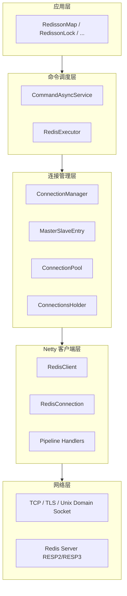
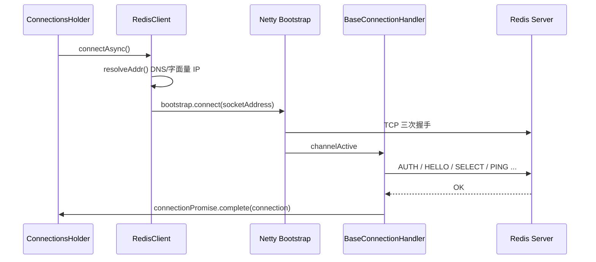
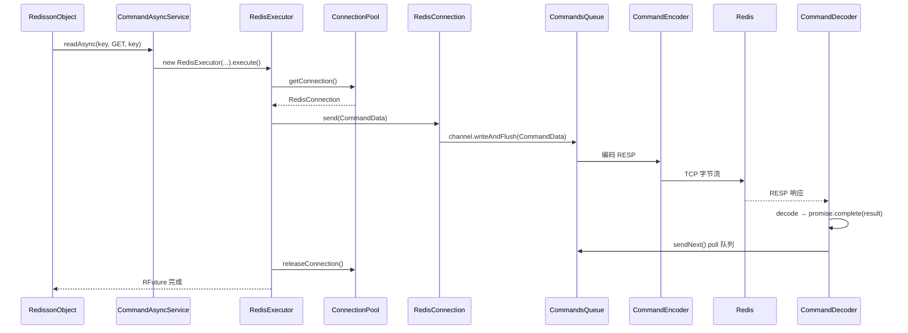

# Redisson 与 Redis 服务器通信机制详解

> 关联文档：[REDISSON_ARCHITECTURE.md](./REDISSON_ARCHITECTURE.md) · [NETTY_HASHED_WHEEL_TIMER.md](./NETTY_HASHED_WHEEL_TIMER.md)  
> 版本：4.4.1-SNAPSHOT · Netty 4.2.14.Final

---

## 目录

1. [通信架构总览](#1-通信架构总览)
2. [传输层：TCP 连接建立](#2-传输层tcp-连接建立)
3. [Netty Channel Pipeline](#3-netty-channel-pipeline)
4. [连接握手与认证](#4-连接握手与认证)
5. [连接池与连接获取](#5-连接池与连接获取)
6. [命令路由与节点选择](#6-命令路由与节点选择)
7. [命令完整生命周期](#7-命令完整生命周期)
8. [RESP 协议编解码](#8-resp-协议编解码)
9. [Codec 与 Java 对象序列化](#9-codec-与-java-对象序列化)
10. [集群模式：MOVED / ASK](#10-集群模式moved--ask)
11. [Pub/Sub 专用连接](#11-pubsub-专用连接)
12. [批处理与 Pipeline](#12-批处理与-pipeline)
13. [超时、重试与断线重连](#13-超时重试与断线重连)
14. [总结](#14-总结)

---

## 1. 通信架构总览

Redisson **不通过 Jedis/Lettuce 等第三方协议库**，而是基于 **Netty** 自研完整的 Redis 客户端协议栈，从 TCP 连接到 RESP 编解码、连接池、集群路由均在 `org.redisson.client` 与 `org.redisson.connection` 包内实现。

### 1.1 分层模型



### 1.2 一次 `GET` 请求的路径（概念）

```
bucket.get()
  → commandExecutor.readAsync(key, codec, RedisCommands.GET, key)
  → CommandAsyncService.async() 创建 RedisExecutor
  → RedisExecutor.getConnection() 从连接池借连接
  → RedisConnection.send(CommandData)
  → Netty: CommandsQueue → CommandEncoder → Socket
  → Redis 返回 RESP 响应
  → Netty: CommandDecoder 解析 → 完成 CompletableFuture
  → Codec 反序列化 → 返回 Java 对象
  → 连接归还连接池
```

---

## 2. 传输层：TCP 连接建立

### 2.1 RedisClient 与双 Bootstrap

每个 Redis 节点对应一个 `RedisClient` 实例，内部维护 **两个** Netty `Bootstrap`：

| Bootstrap | 用途 | Channel 类型 |
|-----------|------|-------------|
| `bootstrap` | 普通命令（GET/SET/Lua 等） | `RedisConnection` |
| `pubSubBootstrap` | 订阅/发布（SUBSCRIBE/PUBLISH） | `RedisPubSubConnection` |

**原因：** 连接一旦执行 `SUBSCRIBE` 进入订阅模式，该连接只能接收推送消息，不能再发送普通命令，必须物理隔离。

```java
// RedisClient.java 构造函数片段
bootstrap = createBootstrap(copy, Type.PLAIN);
pubSubBootstrap = createBootstrap(copy, Type.PUBSUB);
```

### 2.2 支持的传输方式

| 方式 | 配置 | 说明 |
|------|------|------|
| TCP | `redis://host:6379` | 默认，NIO/EPOLL/KQUEUE/IO_URING |
| TLS | `rediss://` 或 `Config` SSL 配置 | Pipeline 首部插入 `SslHandler` |
| Unix Domain Socket | UDS 地址 + EPOLL/KQUEUE | `DomainSocketChannel`，仅单节点模式 |

`ServiceManager` 根据 `Config.transportMode` 创建 `NioEventLoopGroup` / `EpollEventLoopGroup` 等，并配置 DNS 解析器（`DnsAddressResolverGroup`）。

### 2.3 异步建连流程



核心代码（`RedisClient.connectAsync()`）：

```java
ChannelFuture channelFuture = bootstrap.connect(res);
channelFuture.addListener(future -> {
    if (future.isSuccess()) {
        RedisConnection c = RedisConnection.getFrom(future.channel());
        c.getConnectionPromise().whenComplete((res1, e) -> {
            // 握手完成后才 complete 外层 Future
        });
    }
});
```

**要点：** `RedisConnection` 在 `channelRegistered` 时创建并绑定到 Channel 属性，但对外可用需等待 `connectionPromise` 完成（握手成功）。

---

## 3. Netty Channel Pipeline

`RedisChannelInitializer` 为每条连接组装 Pipeline，**PLAIN（命令）** 与 **PUBSUB** 模式略有不同。

### 3.1 命令连接 Pipeline（出站 → 入站）

```
Outbound (write):  应用
                      ↓
                   CommandsQueue        ← 命令 FIFO 队列、串行化
                      ↓
                   CommandEncoder       ← RESP 编码（单条命令）
                   CommandBatchEncoder  ← RESP 编码（批量）
                      ↓
                   [SslHandler]         ← 可选
                      ↓
                   Socket

Inbound (read):    Socket
                      ↓
                   [SslHandler]
                      ↓
                   ConnectionWatchdog     ← 断线重连
                   PingConnectionHandler  ← 可选心跳
                      ↓
                   CommandDecoder         ← RESP 解码
                      ↓
                   ErrorsLoggingHandler
```

### 3.2 关键 Handler 职责

| Handler | 类型 | 职责 |
|---------|------|------|
| `RedisConnectionHandler` | Inbound | 创建 `RedisConnection`，触发握手 |
| `ConnectionWatchdog` | Inbound | `channelInactive` 时自动重连 |
| `CommandsQueue` | Duplex | 保证同连接命令 **FIFO** 发送，与响应一一对应 |
| `CommandEncoder` | Outbound | `CommandData` → RESP 字节流 |
| `CommandBatchEncoder` | Outbound | `CommandsData` → 多条 RESP 拼接 |
| `CommandDecoder` | Inbound | RESP 字节流 → 完成 `CommandData.promise` |
| `PingConnectionHandler` | Duplex | 定时 PING 保活 |

### 3.3 CommandsQueue：同连接串行

Redis 要求：**单连接上的请求与响应顺序严格对应**。`CommandsQueue` 在 `write` 时：

1. 将 `QueueCommand` 包装为 `QueueCommandHolder` 入队 `COMMANDS_QUEUE`（Channel 属性上的 `Deque`）
2. 调用 `ctx.writeAndFlush(data)` 真正下发
3. `CommandDecoder` 收到完整响应后 `queue.poll()`，处理下一条

```java
// CommandsQueue.write()
lock.executeInterruptibly(() -> {
    queue.add(holder);
    ctx.writeAndFlush(data, holder.getChannelPromise());
});
```

**channelInactive** 时：非阻塞命令从队列移除并 `tryFailure`，阻塞命令（如 `BLPOP`）保留以便重连后续处理。

---

## 4. 连接握手与认证

TCP 连接建立后，`BaseConnectionHandler.channelActive()` 在 **同一条连接上** 串行发送初始化命令：

```java
// BaseConnectionHandler.channelActive()
List<CompletableFuture<?>> futures = new ArrayList<>();

futures.add(authWithCredential());                    // AUTH [username] password

if (config.getProtocol() == Protocol.RESP3) {
    futures.add(connection.async(RedisCommands.HELLO, "3").toCompletableFuture());
}
if (config.getDatabase() != 0) {
    futures.add(connection.async(RedisCommands.SELECT, config.getDatabase()).toCompletableFuture());
}
if (config.getClientName() != null) {
    futures.add(connection.async(RedisCommands.CLIENT_SETNAME, config.getClientName()).toCompletableFuture());
}
if (!config.getCapabilities().isEmpty()) {
    futures.add(connection.async(RedisCommands.CLIENT_CAPA, ...).toCompletableFuture());
}
if (config.isReadOnly()) {
    futures.add(connection.async(RedisCommands.READONLY).toCompletableFuture());
}
if (config.getPingConnectionInterval() > 0) {
    futures.add(connection.async(RedisCommands.PING).toCompletableFuture());
}

CompletableFuture.allOf(futures).whenComplete((res, e) -> {
  connectionPromise.complete(connection);  // 握手成功，连接可用
});
```

| 步骤 | Redis 命令 | 目的 |
|------|-----------|------|
| 认证 | `AUTH` / ACL 用户名密码 | 安全访问 |
| 协议 | `HELLO 3` | 启用 RESP3、协商能力 |
| 库选择 | `SELECT db` | 非 0 号库 |
| 客户端名 | `CLIENT SETNAME` | 服务端 `CLIENT LIST` 可识别 |
| 只读副本 | `READONLY` | 集群从节点读 |
| 保活 | `PING` | 验证连接可用 |

**凭证：** `CredentialsResolver` 支持动态凭证；`authWithCredential()` 合并 URL、Config、Resolver 中的用户名密码。

**凭证轮换：** `startRenewal()` 在 `credentialsResolver.nextRenewal()` 时重新 AUTH，失败则关闭 Channel。

---

## 5. 连接池与连接获取

### 5.1 拓扑结构

```
ConnectionManager
  └── MasterSlaveEntry (每个分片 / 单实例一组)
        ├── masterEntry: ClientConnectionsEntry (Master 节点)
        ├── slave entries: ClientConnectionsEntry (Slave 节点)
        ├── masterConnectionPool      → 写命令
        ├── slaveConnectionPool       → 读命令（ReadMode）
        ├── masterPubSubConnectionPool
        └── slavePubSubConnectionPool
```

每个 `ClientConnectionsEntry` 对应一个 `RedisClient` + 一个 `ConnectionsHolder`。

### 5.2 ConnectionsHolder 池化逻辑

```java
// 核心数据结构
Queue<T> allConnections;           // 所有物理连接
Deque<T> freeConnections;          // 空闲可借连接
AsyncSemaphore freeConnectionsCounter;  // 并发上限 = poolMaxSize
```

**获取连接（`acquireConnection`）：**

1. `freeConnectionsCounter.acquire()` — 信号量，池满则异步等待
2. `pollConnection()` — 从 `freeConnections` 取活跃连接
3. 若无空闲 → `connectionCallback.apply(client)` → `RedisClient.connectAsync()` 新建
4. 返回 `CompletableFuture<RedisConnection>`

**归还连接（`returnConnection`）：**

1. 检查连接是否仍属于当前 `RedisClient`（主从切换时可能废弃）
2. `freeConnections.addFirst(conn)` 放回队首
3. `freeConnectionsCounter.release()` 唤醒等待者

**预热：** `initConnections(minimumIdleSize)` 启动时创建最小空闲连接数。

### 5.3 ConnectionPool 与负载均衡

```java
// ConnectionPool.getTuple()
ClientConnectionsEntry entry = config.getLoadBalancer().getEntry(entriesCopy, command);
return acquireConnection(command, entry, trackChanges);
```

- 过滤 **冻结（freezed）** 与 **不健康** 节点
- `LoadBalancer`（轮询/随机等）选一个 `ClientConnectionsEntry`
- Slave 连接失败时 `FailedNodeDetector` 可能标记节点失败并触发 `shutdownAndReconnectAsync`

---

## 6. 命令路由与节点选择

### 6.1 NodeSource

`CommandAsyncService` 根据 **Key** 计算路由：

```java
private NodeSource getNodeSource(String key) {
    int slot = connectionManager.calcSlot(key);
    return new NodeSource(slot);
}
```

- **单机 / 主从 / Sentinel：** slot 固定为 0 或统一入口
- **Cluster：** `CRC16(key) % 16384`，支持 `{hashTag}` 只哈希花括号内部分

### 6.2 读 / 写分离

| 模式 | 方法 | 连接池 |
|------|------|--------|
| 写 | `writeAsync` → `async(false, ...)` | `masterConnectionPool` |
| 读 | `readAsync` → `async(true, ...)` | `slaveConnectionPool`（受 `ReadMode` 约束） |

`ReadMode`：

- `SLAVE` — 仅从副本读
- `MASTER` — 仅从主节点读
- `MASTER_SLAVE` — 主也可参与读负载

`RedisExecutor.getConnection()` 根据 `readOnlyMode` 调用 `entry.connectionReadOp` 或 `connectionWriteOp`。

### 6.3 RedisExecutor 获取连接

```java
protected CompletableFuture<RedisConnection> getConnection(CompletableFuture<R> attemptPromise) {
    if (readOnlyMode) {
        connectionFuture = connectionReadOp(command, attemptPromise);
    } else {
        connectionFuture = connectionWriteOp(command, attemptPromise);
    }
    // 结合 NodeSource.slot / entry / redirect 解析到具体 MasterSlaveEntry
}
```

---

## 7. 命令完整生命周期

### 7.1 端到端时序图



### 7.2 CommandData：命令载体

```java
public class CommandData<T, R> implements QueueCommand {
    final CompletableFuture<R> promise;   // 结果 Future
    RedisCommand<T> command;              // 命令元数据（名称、解码器）
    final Object[] params;                // 参数（常为 String / byte[] / ByteBuf）
    final Codec codec;                    // 响应反序列化
}
```

发送入口极其简单：

```java
// RedisConnection.java
public <T, R> ChannelFuture send(CommandData<T, R> data) {
    return channel.writeAndFlush(data);
}
```

### 7.3 RedisExecutor 内的超时层次

| 阶段 | 定时器 | 触发条件 |
|------|--------|---------|
| 获取连接 | `scheduleConnectionTimeout` | 连接池耗尽超时 |
| 写入 Channel | `scheduleWriteTimeout` | 命令迟迟未写入 Netty |
| 命令执行 | `RedisConnection.async` 内 HashedWheelTimer | 写成功后等待响应超时 |
| 重试 | `scheduleRetryTimeout` | 失败按 `DelayStrategy` 退避重试 |

### 7.4 响应完成

`CommandDecoder.decodeCommand()` 解析完毕后：

```java
decode(in, cmd, ...);
sendNext(channel, data);  // queue.poll()，处理下一条命令
// 内部调用 cmd.getPromise().complete(result)
```

`RedisExecutor.checkAttemptPromise()` 将结果交给 `mainPromise`，并 `releaseConnection` 归还连接。

---

## 8. RESP 协议编解码

Redisson 实现 **RESP2** 与 **RESP3**（通过 `HELLO 3` 协商），编解码器手写于 `CommandEncoder` / `CommandDecoder`，非第三方库。

### 8.1 请求编码（CommandEncoder）

采用 Redis **统一协议（Array of Bulk Strings）**：

```
*<argc>\r\n
$<len>\r\n<command>\r\n
$<len>\r\n<arg1>\r\n
...
```

实现要点：

```java
// 参数个数
out.writeByte('*');
out.writeBytes(longToString(1 + params.length));
out.writeBytes(CRLF);

// 命令名（可经 CommandMapper 映射，如 Valkey 兼容）
writeArgument(out, commandName.getBytes(UTF_8));

// 每个参数
for (Object param : params) {
    ByteBuf buf = encode(param);  // byte[] / ByteBuf / UTF-8 字符串
    writeArgument(out, buf);
}
```

`writeArgument` 格式：`$<length>\r\n<payload>\r\n`

**性能优化：** `longToString` 对 0–999 使用预缓存字节数组，减少小整数分配。

### 8.2 响应解码（CommandDecoder）

继承 Netty `ReplayingDecoder<State>`，按首字节分支：

| 前缀 | RESP 类型 | 含义 |
|------|----------|------|
| `+` | Simple String | OK 等 |
| `-` | Error | 错误（可转 `RedisRedirectException`） |
| `:` | Integer | 整数 |
| `$` | Bulk String | 二进制安全字符串 |
| `*` | Array | 数组（多 bulk） |
| `_` | Null (RESP3) | 空 |
| `,` `~` `%` `=` 等 | RESP3 扩展 | Map、Set、Push 等 |

解码流程：

1. 从 `CommandsQueue.COMMANDS_QUEUE` **peek** 当前 `QueueCommandHolder`
2. 解析 RESP 与 `RedisCommand` 绑定的 `ReplayDecoder` / `MultiDecoder`
3. 通过 `Codec` 将 `ByteBuf` 转为 Java 类型
4. `promise.complete(result)`，`sendNext()` 出队

**无命令时的数据：** 推送类消息（如 Client-side caching）由 `data == null` 分支 `skipDecode` 消费。

### 8.3 错误与重定向

`-ERR` 解析为 `RedisException`；集群重定向：

```
-MOVED 3999 127.0.0.1:6381
-ASK 3999 127.0.0.1:6381
```

转为 `RedisRedirectException`，由 `RedisExecutor` 捕获后 `handleRedirect()` 重新选节点发送。

---

## 9. Codec 与 Java 对象序列化

### 9.1 两层编码分工

| 层次 | 位置 | 职责 |
|------|------|------|
| **业务 Codec** | `RedissonObject` / `CommandAsyncService.encode()` | Java 对象 → `ByteBuf`（Kryo/Jackson 等） |
| **协议编码** | `CommandEncoder` | `ByteBuf` / `byte[]` / `String` → RESP Bulk String |

典型调用（`RedissonBucket`）：

```java
commandExecutor.writeAsync(getRawName(), codec, RedisCommands.SET,
    getRawName(),           // key：String，直接 UTF-8
    encode(value));         // value：经 Kryo5Codec 等编码为 ByteBuf
```

### 9.2 CommandEncoder 对参数类型的处理

```java
private ByteBuf encode(Object in) {
    if (in == null) return new EmptyByteBuf(...);
    if (in instanceof byte[]) return Unpooled.wrappedBuffer((byte[]) in);
    if (in instanceof ByteBuf) return (ByteBuf) in;
    if (in instanceof ChannelName) return Unpooled.wrappedBuffer(...);
    // 否则按 UTF-8 字符串
    String payload = in.toString();
    ...
}
```

### 9.3 响应反序列化

`CommandDecoder` 得到 bulk 的 `ByteBuf` 后，调用 `CommandData.codec` 的 `getValueDecoder().decode(buf, state)`，将字节转为 `String`、`Long`、`List`、`Map` 或自定义对象。

**Live Object / Reference：** `RedissonObjectBuilder` 可在编解码前后处理 `@REntity` 引用。

---

## 10. 集群模式：MOVED / ASK

### 10.1 槽位计算

```java
// CRC16.java — 与 Redis Cluster 规范一致
int slot = CRC16.crc16(keyBytes) % 16384;
// 含 {tag} 时只对 tag 部分计算
```

`ClusterConnectionManager` 维护 `slot2entry[16384]`，将槽映射到 `MasterSlaveEntry`。

### 10.2 MOVED：永久重定向

收到 `MOVED slot ip:port`：

1. 更新本地槽位映射（若配置允许）
2. 构造 `NodeSource(slot, addr, Redirect.MOVED)`
3. **重新执行** 同一命令到新节点

### 10.3 ASK：临时重定向（迁移中）

收到 `ASK slot ip:port`：

```java
// RedisExecutor.sendCommand()
if (source.getRedirect() == Redirect.ASK) {
    list.add(new CommandData<>(..., RedisCommands.ASKING, ...));  // 先发 ASKING
    list.add(new CommandData<>(..., command, params));              // 再发真实命令
    connection.send(new CommandsData(main, list, false, false));
}
```

`ASKING` 告知目标节点「本次命令针对正在导入的槽」，避免 `MOVED`。

### 10.4 重定向循环保护

```java
if (source.getRedirect() == Redirect.MOVED && /* 循环检测 */) {
    mainPromise.completeExceptionally(
        new RedisException("MOVED redirection loop detected..."));
}
```

---

## 11. Pub/Sub 专用连接

### 11.1 为何分离

- `SUBSCRIBE` 后连接进入 **push-only** 模式
- 普通 `GET/SET` 不能与普通订阅共用同一 TCP 连接

### 11.2 架构

```
PublishSubscribeService
  → MasterPubSubConnectionPool / PubSubConnectionPool
  → RedisClient.connectPubSubAsync()  // pubSubBootstrap
  → CommandsQueuePubSub + CommandPubSubDecoder
```

### 11.3 订阅流程（简化）

1. 应用 `topic.addListener(...)` 
2. `PublishSubscribeService` 获取/创建 PubSub 连接
3. 发送 `SUBSCRIBE channel` 或 `PSUBSCRIBE pattern`
4. `CommandPubSubDecoder` 解析 **push 消息**（非请求-响应模式）
5. 分发给注册的 `MessageListener`

**锁唤醒：** `LockPubSub` 订阅 `redisson_lock__channel:{lockName}`，收到 unlock 消息后唤醒等待线程。

---

## 12. 批处理与 Pipeline

### 12.1 CommandsData

多条命令打包为一个 `QueueCommand`：

```java
connection.send(new CommandsData(mainPromise, listOfCommandData, queued, atomic));
```

`CommandBatchEncoder` 循环调用 `CommandEncoder.encode()` 拼接到同一 TCP 写缓冲区 → **Pipeline**，减少 RTT。

### 12.2 使用场景

| 场景 | 类 |
|------|-----|
| 用户 `RBatch` | `CommandBatchService` |
| 事务提交 | `RedissonTransaction` + `IN_MEMORY_ATOMIC` |
| ASK 重定向 | 临时 `CommandsData`（ASKING + 原命令） |
| 同步到 Slave | 批末 `WAIT` 命令 |

### 12.3 响应解析

`CommandDecoder.decodeCommandBatch()` 按顺序解析多条 RESP 响应，分别 `complete` 各 `CommandData.promise`；`MULTI/EXEC` 有专门分支处理嵌套结果。

---

## 13. 超时、重试与断线重连

### 13.1 命令超时

```java
// RedisConnection.async()
Timeout scheduledFuture = redisClient.getTimer().newTimeout(t -> {
    promise.completeExceptionally(new RedisTimeoutException(...));
}, timeout, TimeUnit.MILLISECONDS);

promise.whenComplete((res, e) -> scheduledFuture.cancel());
```

使用 Netty `HashedWheelTimer`（详见 [NETTY_HASHED_WHEEL_TIMER.md](./NETTY_HASHED_WHEEL_TIMER.md)）。

### 13.2 失败重试

`RedisExecutor` 在 `attempt < retryAttempts` 时：

- 按 `DelayStrategy` 计算退避
- 重新 `getConnection` + `sendCommand`
- 写失败、连接失败、部分 `RedisException` 可重试

`noRetry=true` 用于锁等强一致场景（`evalWriteNoRetryAsync`）。

### 13.3 ConnectionWatchdog

```java
// channelInactive 时
if (!connection.isClosed()) {
    reconnect(connection, attempt);  // 指数退避 + timer
}
```

重连成功后：

- 非 PubSub：恢复命令队列中 **非阻塞** 命令
- 阻塞命令：可能 `forceFastReconnectAsync` 换连接

### 13.4 节点级故障

`FailedNodeDetector` 累计命令失败后标记节点，触发 `MasterSlaveEntry.shutdownAndReconnectAsync` 重建该节点所有连接。

---

## 14. 总结

### 14.1 通信机制要点

| 维度 | Redisson 实现 |
|------|--------------|
| **网络库** | Netty 4.x（NIO/EPOLL/KQUEUE/IO_URING） |
| **协议** | 自研 RESP2/RESP3 编解码 |
| **连接模型** | 每节点 RedisClient + 连接池（ConnectionsHolder） |
| **命令模型** | CommandData + CompletableFuture 异步 |
| **串行保证** | CommandsQueue 每连接 FIFO |
| **路由** | NodeSource + CRC16 槽位 + 读写分离 |
| **集群** | MOVED/ASK + ASKING |
| **Pub/Sub** | 独立 Bootstrap 与 Decoder |
| **对象映射** | Codec（Kryo/Jackson/...）+ RESP Bulk |

### 14.2 与 Lettuce/Jedis 的差异（通信视角）

| 特性 | Jedis | Lettuce | Redisson |
|------|-------|---------|----------|
| I/O 模型 | 阻塞 Socket | Netty 异步 | Netty 异步 |
| API 层 | 命令字符串 | 命令接口 | 分布式对象 + 命令 |
| 连接复用 | 连接池（JedisPool） | 连接共享 | 每节点池 + 借用归还 |
| 协议实现 | 内置 | Netty Codec | 自研 Encoder/Decoder |
| 集群 | JedisCluster | 内置 | ClusterConnectionManager + 槽位表 |

### 14.3 核心类索引

| 功能 | 类 | 包 |
|------|-----|-----|
| 建连 | `RedisClient` | `org.redisson.client` |
| 连接句柄 | `RedisConnection` | `org.redisson.client` |
| Pipeline | `RedisChannelInitializer` | `client.handler` |
| 命令队列 | `CommandsQueue` | `client.handler` |
| 编码 | `CommandEncoder` | `client.handler` |
| 解码 | `CommandDecoder` | `client.handler` |
| 握手 | `BaseConnectionHandler` | `client.handler` |
| 重连 | `ConnectionWatchdog` | `client.handler` |
| 命令定义 | `RedisCommands` | `client.protocol` |
| 调度 | `CommandAsyncService` | `org.redisson.command` |
| 执行 | `RedisExecutor` | `org.redisson.command` |
| 连接池 | `ConnectionsHolder` | `org.redisson.connection` |
| 拓扑 | `ConnectionManager` | `org.redisson.connection` |
| 分片 | `MasterSlaveEntry` | `org.redisson.connection` |
| 槽位 | `CRC16` | `org.redisson.connection` |
| Pub/Sub | `PublishSubscribeService` | `org.redisson.pubsub` |

---

## 附录 A：RESP 请求示例（SET）

逻辑命令：

```
SET mykey <binary-value>
```

线上字节（概念）：

```
*3\r\n
$3\r\n
SET\r\n
$5\r\n
mykey\r\n
$<N>\r\n
<binary payload>\r\n
```

由 `CommandEncoder` 生成，经 TCP 发往 Redis。

## 附录 B：连接状态机（RedisConnection.Status）

| 状态 | 含义 |
|------|------|
| `OPEN` | 可用 |
| `CLOSED` | 已关闭 |
| `CLOSED_IDLE` | 空闲关闭（可重建） |

---

*本文档基于 Redisson 4.4.1-SNAPSHOT 源码分析生成。*
